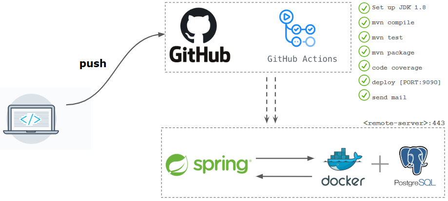

### Automate your development workflow with Github Actions.

 

The idea is to automate the development workflow and to build a CI/CD pipeline using Github Actions, the pipeline will deploy Spring Boot web service to a remote server (cloud). we will use a succession of jobs to install the required packages, compile, run tests, get report of code coverage and generate package then deploy it on the remote server, finally send the result report in an Email. Below a diagram illustrating the workflow :

See more about the article [HERE](https://medium.com/@hacene.upmc/automate-your-development-workflow-with-github-actions-220a737abb3c)
